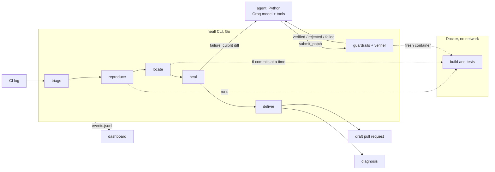

# heall

**A self-healing CI agent.** When your build goes red, heall finds the commit that broke it, asks an AI model for a fix, **proves** the fix inside a sandbox, and opens a draft pull request with the evidence. If it cannot prove a fix, it does not guess: it stops and writes down why.

```
triage  →  reproduce  →  locate  →  heal  →  deliver
```

Every stage either produces evidence for the next one, or stops the run with an explanation.

---

## Table of Contents

1. [What is heall?](#1-what-is-heall)
2. [Why it is different](#2-why-it-is-different)
3. [Results](#3-results)
4. [Prerequisites](#4-prerequisites)
5. [Quick start: install the ready-made CLI](#5-quick-start-install-the-ready-made-cli)
6. [Setup from source: run the demo on your laptop](#6-setup-from-source-run-the-demo-on-your-laptop)
7. [Use heall on your own repository](#7-use-heall-on-your-own-repository)
8. [The dashboard](#8-the-dashboard)
9. [Commands](#9-commands)
10. [Configuration (`.heall.yaml`)](#10-configuration-heallyaml)
11. [Project structure](#11-project-structure)
12. [How it works](#12-how-it-works)
13. [Safety](#13-safety)
14. [Limits](#14-limits)
15. [Troubleshooting](#15-troubleshooting)
16. [Development and testing](#16-development-and-testing)
17. [Deployment (optional)](#17-deployment-optional)
18. [Releasing](#18-releasing)

---

## 1. What is heall?

Most "AI fixes your CI" tools send a log to a model and paste back a patch. heall works like a careful engineer instead:

1. **Triage**: reads the CI log and finds the failing test.
2. **Reproduce**: runs the test to confirm the failure is real and not flaky.
3. **Locate**: runs a parallel bisect to find the exact commit that broke it.
4. **Heal**: shows the culprit diff to a model, which proposes a fix.
5. **Deliver**: verifies the fix from scratch, then opens a draft pull request (or writes a diagnosis if it can't prove a fix).

---

## 2. Why it is different

1. **It finds the culprit first.** A parallel bisect tests several commits at once, each in its own git worktree and container, so the model sees exactly what changed.
2. **It verifies everything.** A patch is applied to a clean checkout, and the failing test plus the whole suite run in a fresh container with **no network**. heall repeats that check itself before delivering.
3. **It has guardrails the model cannot argue with.** A patch that touches a test, touches a file outside the allowed paths, or adds code that detects the test runner is rejected without being run. These are plain code in the CLI.

And it **refuses** when it should: a flaky test is caught before bisecting, and a test that contradicts a deliberate change ends in a diagnosis, not a hack.

---

## 3. Results

Measured on the demo repository: five seeded bugs, each on a branch of 120 commits. Three should be fixed and two should be refused.

| Measured | Result |
|---|---|
| Right culprit commit found | 12 of 12 runs |
| Fixable bugs fixed and verified | 9 of 9 runs |
| Bugs that should be refused, refused | 6 of 6 runs |
| Wrong fixes delivered | 0 |
| Patches per verified fix | 1.0 |
| Rounds to search 120 commits | 3 with six workers, against 7 one at a time |
| Search time when a test run takes 3s | 10.2s, against 23.1s for `git bisect run` (2.3× faster) |
| Search time with the demo's 0.3s test | No real difference: about 3 to 8s for both |

That is 3 live runs per bug with the model `openai/gpt-oss-120b`. It is a small sample on bugs we wrote ourselves, so it shows the pipeline works end to end rather than how it does on real projects.

More details: [docs/results.md](docs/results.md) and [docs/benchmark.md](docs/benchmark.md). Reproduce with `scripts/evaluate.py` and `scripts/benchmark.py`.

---

## 4. Prerequisites

### To only **use** heall (install the ready-made CLI)

| Tool | Why | Check with |
|---|---|---|
| **Git** | heall reads your commit history | `git --version` |
| **Docker** | tests run in a sandbox container | `docker --version` and `docker ps` |
| **Python 3.10+** | the agent (AI part) runs on Python | `python3 --version` |
| **Groq API key** | the AI model | free at [console.groq.com](https://console.groq.com) |
| **Node.js** (optional) | only to use `npm` / `npx` install | `node --version` |
| **GitHub CLI `gh`** (optional) | only to open pull requests | `gh --version` |

### To **build from source** (run the demo / contribute)

Everything above, plus:

| Tool | Version | Check with |
|---|---|---|
| **Go** | 1.25 or newer | `go version` |
| **Node.js** | 24 | `node --version` |
| **pnpm** | any recent | `pnpm --version` |
| **make** | any | `make --version` |

### Operating system

- **Linux** and **macOS**: supported directly.
- **Windows**: use **WSL2** (Ubuntu). Run every command below inside the WSL terminal. Make sure Docker Desktop has "WSL integration" turned on.

### Quick installs

**Ubuntu / Debian / WSL**

```bash
sudo apt update
sudo apt install -y git make python3 python3-pip curl
# Docker: https://docs.docker.com/engine/install/
# Go:     https://go.dev/doc/install
# Node 24 (via nvm):
curl -o- https://raw.githubusercontent.com/nvm-sh/nvm/master/install.sh | bash
nvm install 24
npm install -g pnpm
```

**macOS (Homebrew)**

```bash
brew install git go node python make gh
brew install --cask docker
npm install -g pnpm
```

> After installing Docker, **start it** (open Docker Desktop, or `sudo systemctl start docker` on Linux). Run `docker ps`; if it prints a table (even an empty one) without an error, Docker is ready.

---

## 5. Quick start: install the ready-made CLI

Pick **one** of these:

```bash
# Option A: npm (global)
npm install -g heall

# Option B: no install, run directly
npx heall init

# Option C: install script (no npm needed)
curl -fsSL https://heall.rexial.in/install | sh
```

You get one self-contained program. It is checked against its published checksum before it runs.

Verify:

```bash
heall --help
heall doctor      # checks that your machine has everything a run needs
```

Then jump to [Use heall on your own repository](#7-use-heall-on-your-own-repository).

---

## 6. Setup from source: run the demo on your laptop

This is the best way to **see heall working** end to end on a safe, ready-made repository.

### Step 1: Clone the repository

```bash
git clone https://github.com/<your-username>/heall.git
cd heall
```

### Step 2: Add your Groq API key

```bash
cp .env.example .env
```

Open `.env` in any editor and paste your key from [console.groq.com](https://console.groq.com):

```env
GROQ_API_KEY=your_key_here
```

> Never commit `.env`. It is already listed in `.gitignore`.

### Step 3: Build everything

```bash
make web build demo
```

This does three things:

| Target | What it builds |
|---|---|
| `web` | the dashboard (static Next.js site) |
| `build` | the Go CLI at `bin/heall` (it embeds the agent and the dashboard, so it runs from anywhere) |
| `demo` | the demo repository with 5 seeded bugs, at `demo/out/repo` |

The first run takes a few minutes (it downloads dependencies).

### Step 4: Check that everything is in place

```bash
scripts/preflight.sh
```

If it reports a missing tool, install it and run the script again.

### Step 5: Run heall on the demo bug

```bash
bin/heall run --repo demo/out/repo --good main --bad bug/off-by-one --dry-run
```

- `--repo`: the repository to heal
- `--good`: a branch/commit where the build was green
- `--bad`: the branch/commit where the build is red
- `--dry-run`: save the patch and a report under `.heall/`, and touch nothing else (no push, no PR)

You should see the stages go by: triage → reproduce → locate → heal → deliver, and a verified patch at the end.

### Step 6: Look at the result

The patch and report are saved under `.heall/` inside the repo you ran against. Open the report to see the culprit commit, the proposed fix and the evidence.

Want to try the other seeded bugs? List the demo branches:

```bash
git -C demo/out/repo branch -a
```

Some bugs are **meant to be refused** (flaky test, test that contradicts a deliberate change). In those cases heall exits with code `3` and writes a diagnosis. That is correct behaviour.

---

## 7. Use heall on your own repository

### Step 1: Put your Groq key where heall can find it

```bash
mkdir -p ~/.config/heall
echo "GROQ_API_KEY=your_key_here" > ~/.config/heall/env
```

### Step 2: Initialise your project

```bash
cd your-project
heall init
```

`heall init` looks at the project, proposes the test commands, the Docker image, and which paths a fix may touch, writes a `.heall.yaml`, and tells you what is missing on your machine.

> **Read the `.heall.yaml` it writes.** It is short, and it decides what the agent is allowed to change.

### Step 3: Do a dry run first

```bash
heall run --good <last green commit> --dry-run
```

Replace `<last green commit>` with the hash (or tag/branch) of the last commit where CI passed. Dry run saves the patch and a report under `.heall/` and changes nothing else.

### Step 4 (optional): Open a real draft pull request

```bash
gh auth login        # one time
heall run --good <last green commit>
```

Without `--dry-run`, a verified fix is pushed to a `heall/fix-…` branch and opened as a **draft** pull request. You can also publish an earlier dry run:

```bash
heall pr .heall/<run-dir>
```

### What works today

- JavaScript projects tested with Node's built-in runner (`node --test`) and **no npm dependencies**.
- Tests run in a fresh checkout in a container with **no network**, so there is no `npm install` step yet.
- Projects that need `npm install`, and other runners such as Jest, are **not supported yet**. `heall init` tells you when it sees them.

---

## 8. The dashboard

Watch runs in the browser:

```bash
heall serve
```

Open **http://localhost:7777**. A run started anywhere in that repository appears by itself, live, or you can replay a recorded run. The server only listens on your own machine.

If you built from source, use `bin/heall serve`.

---

## 9. Commands

| Command | What it does |
|---|---|
| `heall init` | Connect a repository: write its `.heall.yaml` and check the machine |
| `heall doctor` | Check that this machine has what a run needs |
| `heall run` | The whole pipeline, from a failing build to a pull request or a diagnosis |
| `heall triage [log]` | Find the failing test in a test log, or by running the suite |
| `heall reproduce` | Confirm the failure is real and not flaky |
| `heall locate` | Find the culprit commit with a parallel bisect |
| `heall heal` | Run the agent on a known culprit and verify what it proposes |
| `heall pr <run dir>` | Publish the fix of an earlier dry run as a draft pull request |
| `heall serve` | Serve the dashboard and the recorded runs |

**Exit codes**

| Code | Meaning |
|---|---|
| `0` | The stage succeeded |
| `3` | heall **escalated on purpose** (it could not prove a fix, and explained why) |
| `1` | An error |

Every command has `--help`, for example `heall run --help`.

---

## 10. Configuration (`.heall.yaml`)

A repository opts in with a `.heall.yaml` at its root. It gives:

- the **build and test commands**,
- the Docker image to run them in,
- the **paths a patch may touch** and **may not touch**.

`heall init` generates it for you. A full example is in [contracts/examples/heall.yaml](contracts/examples/heall.yaml).

---

## 11. Project structure

```
heall/
├── agent/                 # Python: the heal stage (model + tools)
│   ├── ...
│   ├── test_llm.py
│   └── pyproject.toml
├── cli/                   # Go: the pipeline, sandbox, bisect, guardrails, verifier
│   ├── cmd/               #   command entry points
│   ├── embedded/          #   agent + dashboard embedded in the binary
│   ├── internal/          #   core logic
│   ├── go.mod
│   ├── go.sum
│   └── main.go
├── contracts/             # what the three parts agree on
│   ├── examples/          #   example .heall.yaml
│   └── README.md          #   event stream + agent protocol
├── demo/                  # generates the demo repo with seeded bugs
│   ├── recordings/        #   recorded runs (for dashboard replay)
│   ├── generate.mjs
│   └── README.md
├── deploy/                # optional: host the dashboard on a server
│   ├── Caddyfile
│   ├── setup-behind-proxy.sh
│   └── setup-vps.sh
├── docs/                  # results, benchmark and demo documentation
├── npm/                   # the npm package that downloads the binary
├── scripts/               # preflight, evaluate, benchmark scripts
├── web/                   # Next.js dashboard
├── .gitignore
├── heall.md
├── install.sh             # the curl | sh installer
├── Makefile               # build / test / release shortcuts
└── README.md              # you are here
```

| Part | Language | Role |
|---|---|---|
| [cli/](cli/) | Go | The pipeline, the sandbox, the bisect, the guardrails and the verifier: everything that has to be trusted |
| [agent/](agent/) | Python | The heal stage: a model with tools that reads the code and proposes a fix or escalates |
| [web/](web/) | Next.js | The dashboard: a static site that shows a run live or replays a recorded one |
| [demo/](demo/) | Node | Generates the demo repository, with seeded bugs and their ground truth |
| [contracts/](contracts/) | | What the three parts agree on: the event stream and the agent protocol |

---

## 12. How it works



**The trust boundary.** The agent cannot run tests or accept its own patch. It calls back into the CLI, which counts the attempt, checks the guardrails, applies the patch to a fresh checkout and runs the tests. The agent's word is never taken: before delivering, the CLI verifies the winning patch again from scratch. The patch that is delivered is git's own diff of the verified tree.

**The bisect.** With N workers, each round tests N commits and splits the range into N+1 parts, so 120 commits take 3 rounds with 6 workers instead of 7 with one. The search itself is a pure function with no git or Docker in it, tested for every culprit position and against randomly placed commits that do not build (those are skipped and the search routes around them).

**The agent.** It gets the failing test, the culprit's message and diff, and the files most likely to matter. It has six tools: `read_file`, `list_files`, `search`, `run_test`, `submit_patch` and `escalate`. It sends edits, not diffs; the diff is built for it. It has **three attempts**, counted by the CLI.

---

## 13. Safety

- All code from the repository and from the model runs in Docker with **no network**, no capabilities, and only the commit's directory mounted.
- Credentials are masked in everything sent to the model, and the agent's tools cannot read `.env` files or anything outside the checkout.
- Pull requests are **drafts**. A person reviews and merges.
- The dashboard server listens on this machine only.

---

## 14. Limits

- One language and test runner so far: JavaScript with the Node test runner. The CLI reads the commands from `.heall.yaml`; the log parser and the flakiness hints are what would need extending.
- It works on **one failing test per run**, the first in the log.
- History between the good and the bad commit is followed along first parents; a merge is treated as one commit.
- It has been measured on a small repository with seeded bugs, not on real projects.

---

## 15. Troubleshooting

| Problem | Fix |
|---|---|
| `Cannot connect to the Docker daemon` | Start Docker Desktop (or `sudo systemctl start docker`), then retry. |
| `permission denied` on Docker (Linux) | `sudo usermod -aG docker $USER`, then log out and log back in. |
| `go: command not found` / wrong Go version | Install Go 1.25+ from [go.dev/doc/install](https://go.dev/doc/install). |
| `pnpm: command not found` | `npm install -g pnpm` (Node 24 required). |
| `make: command not found` | Linux: `sudo apt install make`. macOS: `xcode-select --install`. |
| Groq / API key error | Check `.env` (demo) or `~/.config/heall/env` (your own repo). The key must be `GROQ_API_KEY=...` with no quotes or spaces. |
| `scripts/preflight.sh` fails | Read the message: it names the missing tool. Install it and re-run. |
| `scripts/preflight.sh: Permission denied` | `chmod +x scripts/preflight.sh` |
| Windows: commands not working | Use **WSL2** and run everything from the WSL terminal, inside the Linux filesystem (e.g. `~/heall`), not `/mnt/c/...`. |
| `heall init` says project is not supported | Today only Node's built-in test runner with no npm dependencies is supported. |
| Exit code `3` | Not a crash: heall escalated on purpose and wrote a diagnosis in `.heall/`. |
| Dashboard empty at `localhost:7777` | Make sure `heall serve` is running in the same repository where you started the run. |

Still stuck? Run `heall doctor` and include its output when you open an issue.

---

## 16. Development and testing

```bash
make test     # Go, Python and dashboard tests
make e2e      # the whole pipeline on the demo repository, with scripted model replies
```

`make e2e` needs **no API key**. For the demo, see [docs/demo.md](docs/demo.md).

`make build` copies the agent and the built dashboard into the Go tree, so the binary carries both and runs from anywhere.

---

## 17. Deployment (optional)

The [deploy/](deploy/) folder helps you host the dashboard on a server:

- `deploy/setup-vps.sh`: set up a fresh VPS.
- `deploy/setup-behind-proxy.sh`: set up when you already have a reverse proxy.
- `deploy/Caddyfile`: Caddy configuration (automatic HTTPS).

This is only needed if you want a public dashboard. Running locally with `heall serve` needs none of it.

---

## 18. Releasing

```bash
make release
```

builds the archives for Linux and macOS in `dist/` and sets the npm package to the same version. Then publish:

```bash
gh release create <tag> dist/*.tar.gz dist/checksums.txt
cd npm && npm publish
```

The npm package and the install script both download the binary from that GitHub release, so **the release has to exist first**.

---

## License

Add your license here (for example MIT) and a `LICENSE` file at the repository root.