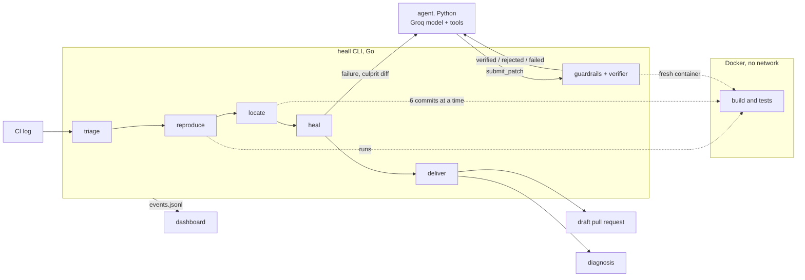

# heall

A self-healing CI agent. When a build goes red, heall finds the commit that
broke it, asks a model for a fix, **proves** the fix in a sandbox, and opens
a draft pull request with the evidence. When it cannot prove a fix, it does
not guess: it stops and writes down why.

```
triage  →  reproduce  →  locate  →  heal  →  deliver
```

Every stage either produces evidence for the next one or stops the run with
an explanation.

## Why it is different

Most "AI fixes your CI" tools send a log to a model and paste back a patch.
heall differs in three ways:

1. **It finds the culprit first.** A parallel bisect tests several commits at
   once, each in its own git worktree and container, so the model is shown
   exactly what changed.
2. **It verifies everything.** The failure is reproduced before any work is
   done. A patch is applied to a clean checkout and the failing test and the
   whole suite are run in a fresh container with no network. heall then
   repeats that check itself before delivering.
3. **It has guardrails the model cannot argue with.** A patch that touches a
   test, a file outside the allowed paths, or adds code that detects the test
   runner is rejected without being run. These are plain code in the CLI.

And it refuses. A flaky test is caught before any bisecting. A test that
contradicts a deliberate change ends in a diagnosis, not a hack.

## Results

Measured on the demo repository: five seeded bugs, each on a branch of 120
commits. Three should be fixed and two should be refused.

| Measured | Result |
|---|---|
| Right culprit commit found | 12 of 12 runs |
| Fixable bugs fixed and verified | 9 of 9 runs |
| Bugs that should be refused, refused | 6 of 6 runs |
| Wrong fixes delivered | 0 |
| Patches per verified fix | 1.0 |
| Rounds to search 120 commits | 3 with six workers, against 7 one at a time |
| Search time when a test run takes 3s | 10.2s, against 23.1s for `git bisect run` (2.3× faster) |
| Search time with the demo's 0.3s test | No real difference: about 3 to 8s for both |

That is 3 live runs per bug with the model `openai/gpt-oss-120b`. It is a small
sample on bugs we wrote ourselves, so it shows the pipeline works end to end
rather than how it does on real projects. The parallel bisect pays off when a
test run takes seconds; on a test this short there is nothing for it to win.

Full tables, and what they do and do not show: [docs/results.md](docs/results.md)
and [docs/benchmark.md](docs/benchmark.md). Both are produced by scripts in
this repository and can be reproduced with `scripts/evaluate.py` and
`scripts/benchmark.py`.

## Quick start

You need Go 1.25+, Python 3.12+, Docker, and Node 24 with pnpm (for the demo
repository and the dashboard). The agent needs a [Groq](https://console.groq.com)
API key.

```
cp .env.example .env        # then put your Groq key in .env
make build web demo         # the CLI, the dashboard, the demo repository
scripts/preflight.sh        # checks that everything is in place
```

Run it on a seeded bug, without touching GitHub:

```
bin/heall run --repo demo/out/repo --good main --bad bug/off-by-one --dry-run
```

Watch a run in the browser: start `make serve`, open `http://localhost:7777`,
and start a run in another terminal. It appears by itself.

Without `--dry-run`, and with `gh auth login` done and the repository pushed
to GitHub, the fix is opened as a draft pull request.

## Commands

| Command | What it does |
|---|---|
| `heall run` | The whole pipeline, from a failing build to a pull request or a diagnosis |
| `heall triage [log]` | Find the failing test in a test log, or by running the suite |
| `heall reproduce` | Confirm the failure is real and not flaky |
| `heall locate` | Find the culprit commit with a parallel bisect |
| `heall heal` | Run the agent on a known culprit and verify what it proposes |
| `heall pr <run dir>` | Publish the fix of an earlier dry run as a draft pull request |
| `heall serve` | Serve the dashboard and the recorded runs |

Exit code 0 means a stage succeeded, 3 means heall escalated on purpose, and
1 is an error. Every command has `--help`.

A repository opts in with a `.heall.yaml` that gives its build and test
commands and the paths a patch may and may not touch. See
[contracts/examples/heall.yaml](contracts/examples/heall.yaml).

## How it works



| Part | Language | Role |
|---|---|---|
| [cli/](cli/) | Go | The pipeline, the sandbox, the bisect, the guardrails and the verifier: everything that has to be trusted |
| [agent/](agent/) | Python | The heal stage: a model with tools that reads the code and proposes a fix or escalates |
| [web/](web/) | Next.js | The dashboard: a static site that shows a run live or replays a recorded one |
| [demo/](demo/) | Node | Generates the demo repository, with seeded bugs and their ground truth |
| [contracts/](contracts/) | | What the three parts agree on: the event stream and the agent protocol |

**The trust boundary.** The agent cannot run tests or accept its own patch.
It calls back into the CLI, which counts the attempt, checks the guardrails,
applies the patch to a fresh checkout and runs the tests. The agent's word is
never taken: before delivering, the CLI verifies the winning patch again from
scratch. The patch that is delivered is git's own diff of the verified tree.

**The bisect.** With N workers, each round tests N commits and splits the
range into N+1 parts, so 120 commits take 3 rounds with 6 workers instead of
7 with one. The search itself is a pure function with no git or Docker in
it, tested for every culprit position and against randomly placed commits
that do not build. Those are skipped, and the search routes around them.

**The agent.** It gets the failing test, the culprit's message and diff, and
the files most likely to matter, and has six tools: `read_file`, `list_files`,
`search`, `run_test`, `submit_patch` and `escalate`. It sends edits, not
diffs; the diff is built for it. It has three attempts, counted by the CLI.

## Safety

- All code from the repository and from the model runs in Docker with no
  network, no capabilities, and only the commit's directory mounted.
- Credentials are masked in everything sent to the model, and the agent's
  tools cannot read `.env` files or anything outside the checkout.
- Pull requests are drafts. A person reviews and merges.
- The dashboard server listens on this machine only.

## Limits

- One language and test runner so far: JavaScript with the Node test runner.
  The CLI itself reads the commands from `.heall.yaml`; the log parser and
  the flakiness hints are what would need extending.
- It works on one failing test per run, the first in the log.
- The history between the good and the bad commit is followed along first
  parents; a merge is treated as one commit.
- It has been measured on a small repository with seeded bugs, not on real
  projects.

## Development

```
make test     # Go, Python and dashboard tests
make e2e      # the whole pipeline on the demo repository, with scripted model replies
```

`make e2e` needs no API key. For the demo, see [docs/demo.md](docs/demo.md).
